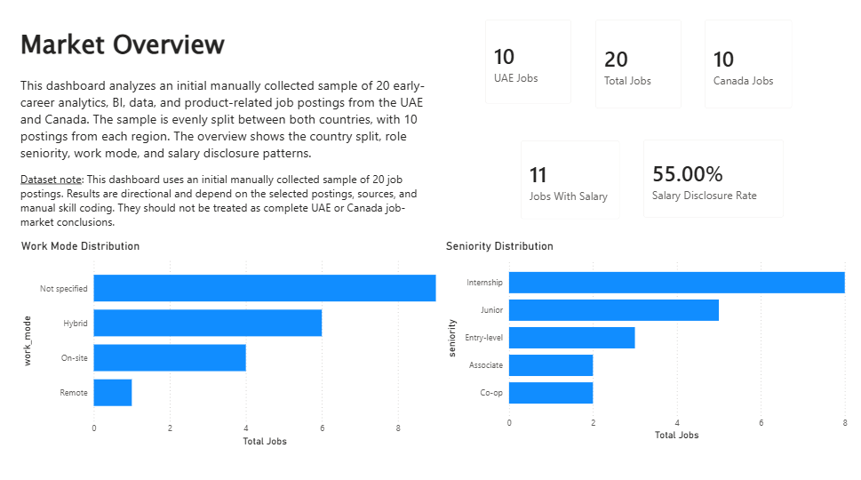
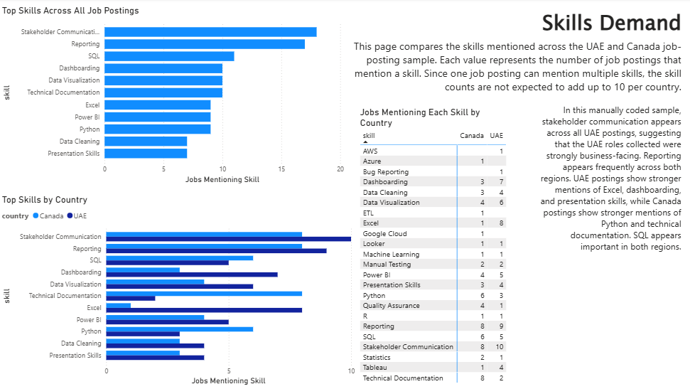
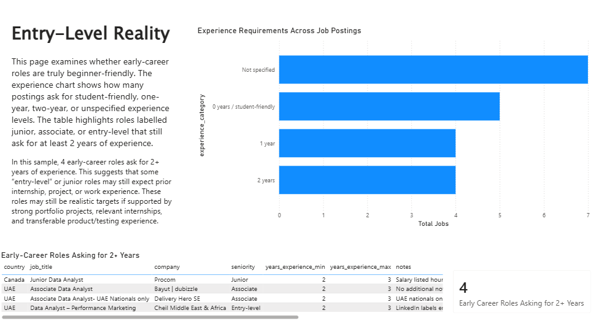
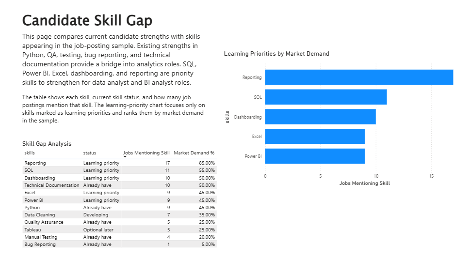

# SkillMap: UAE–Canada Tech Job Market Intelligence Dashboard

## Project Overview

SkillMap is a data analytics portfolio project that analyzes an initial sample of early-career analytics, BI, data, product, and related technology job postings from the UAE and Canada.

The project answers a practical career question:

> What skills, tools, and experience expectations should an early-career data analyst candidate focus on when applying in the UAE and Canada?

The project uses Python, SQL, SQLite, and Power BI to turn manually collected job-posting data into a structured job-market intelligence dashboard.

---

## Tools Used

| Tool              | Purpose                                     |
| ----------------- | ------------------------------------------- |
| Python            | Data cleaning, transformation, and analysis |
| pandas            | CSV processing and exploratory analysis     |
| Jupyter Notebooks | Step-by-step analysis workflow              |
| SQLite            | Local relational database                   |
| SQL               | Querying cleaned job and skill data         |
| Power BI          | Dashboard design and visualization          |
| Git & GitHub      | Version control and portfolio publishing    |

---

## Dataset

The dataset contains an initial manually collected sample of 20 job postings:

* 10 UAE job postings
* 10 Canada job postings

The postings focus on early-career analytics, BI, data, product, and related technology roles.

Each posting includes fields such as job title, company, country, city, source, work mode, seniority, salary information, experience requirements, education requirements, short description, and extracted skills.

Because this is a small manually collected sample, the findings are directional and should not be interpreted as full-market conclusions.

---

## Project Workflow

The project follows a complete analytics workflow:

```text
Raw job postings
→ Python data cleaning
→ Skill extraction
→ Exploratory analysis
→ SQLite database creation
→ SQL analysis
→ Power BI dashboard
```

### Notebook Workflow

| Notebook                                | Purpose                                                                   |
| --------------------------------------- | ------------------------------------------------------------------------- |
| `01_data_collection_and_cleaning.ipynb` | Cleans the raw job-posting data and creates `cleaned_jobs.csv`            |
| `02_skill_extraction.ipynb`             | Splits comma-separated skills into a normalized job-skills table          |
| `03_market_analysis.ipynb`              | Analyzes job counts, skills, experience expectations, and market patterns |
| `04_sql_analysis.ipynb`                 | Uses SQL queries to analyze the cleaned job and skill tables              |

---

## Dashboard Preview

The Power BI dashboard includes four pages:

1. Market Overview
2. Skills Demand
3. Entry-Level Reality
4. Candidate Skill Gap

### Market Overview

This page summarizes total postings, country split, salary disclosure, seniority distribution, and work mode distribution.



### Skills Demand

This page compares the most frequently mentioned skills across UAE and Canada job postings.



### Entry-Level Reality

This page highlights experience expectations and identifies early-career roles that still ask for at least 2 years of experience.



### Candidate Skill Gap

This page compares current candidate strengths with skills appearing in the job-posting sample and identifies priority skills to strengthen.



---

## Key Insights

### 1. Analytics roles are not only technical

Reporting and stakeholder communication appeared frequently in the job-posting sample. This suggests that early-career analytics roles often require both technical ability and business communication skills.

### 2. UAE and Canada postings showed different skill emphasis

In this sample:

* UAE postings showed stronger mentions of Excel, dashboarding, presentation skills, and stakeholder communication.
* Canada postings showed stronger mentions of Python, SQL, and technical documentation.
* SQL appeared important in both regions.

### 3. Some early-career roles still ask for experience

Several roles labelled junior, associate, or entry-level still requested 2 or more years of experience. This suggests that early-career candidates need strong portfolio projects, internships, and transferable experience to compete effectively.

### 4. Candidate skill gaps can become a learning roadmap

The candidate skill-gap analysis identified SQL, Power BI, Excel, dashboarding, and reporting as priority skills to strengthen for data analyst and BI analyst roles.

---

## SQL and Database Work

The project includes a SQLite database created from the processed datasets.

| File                        | Purpose                               |
| --------------------------- | ------------------------------------- |
| `sql/create_tables.sql`     | Defines the database schema           |
| `sql/analysis_queries.sql`  | Stores reusable SQL analysis queries  |
| `scripts/load_to_sqlite.py` | Loads processed CSV files into SQLite |

The database contains two main tables:

* `jobs`: one row per job posting
* `job_skills`: one row per job-skill relationship

---

## Main Project Files

| Path                                | Description                         |
| ----------------------------------- | ----------------------------------- |
| `data/raw/job_postings_sample.csv`  | Original manually collected dataset |
| `data/processed/cleaned_jobs.csv`   | Cleaned job-level dataset           |
| `data/processed/job_skills.csv`     | Normalized job-skill dataset        |
| `data/processed/skillmap.db`        | SQLite database                     |
| `dashboard/skillmap_dashboard.pbix` | Power BI dashboard                  |
| `reports/executive_summary.md`      | Summary of project findings         |
| `reports/methodology.md`            | Methodology and project approach    |

---

## How to Run This Project

1. Clone the repository.
2. Create and activate a Python virtual environment.
3. Install dependencies:

```powershell
pip install -r requirements.txt
```

4. Run the first three notebooks in order:

```text
01_data_collection_and_cleaning.ipynb
02_skill_extraction.ipynb
03_market_analysis.ipynb
```

5. Rebuild the SQLite database:

```powershell
python scripts\load_to_sqlite.py
```

6. Run the SQL analysis notebook:

```text
04_sql_analysis.ipynb
```

7. Open the Power BI file:

```text
dashboard/skillmap_dashboard.pbix
```

Then click **Home → Refresh** in Power BI Desktop.

---

## Limitations

This project is based on an initial manually collected sample of 20 job postings. The results are useful for directional analysis but should not be treated as a complete representation of the UAE or Canadian job market.

Skill extraction was manually standardized, so the results depend on the selected postings and coding decisions.

Salary analysis is limited because some postings do not disclose salary, and disclosed salaries may use different periods such as hourly, monthly, or annual values.

---

## Future Improvements

Future versions could improve the project by:

* expanding the dataset to 100+ job postings
* automating job-posting collection
* applying NLP for skill extraction
* normalizing salary values by period and currency
* building an interactive Streamlit version

---

## What This Project Demonstrates

This project demonstrates skills in:

* real-world data collection and structuring
* Python data cleaning
* skill extraction and normalization
* exploratory data analysis
* SQL querying
* SQLite database creation
* Power BI dashboard design
* job-market analysis
* portfolio project documentation